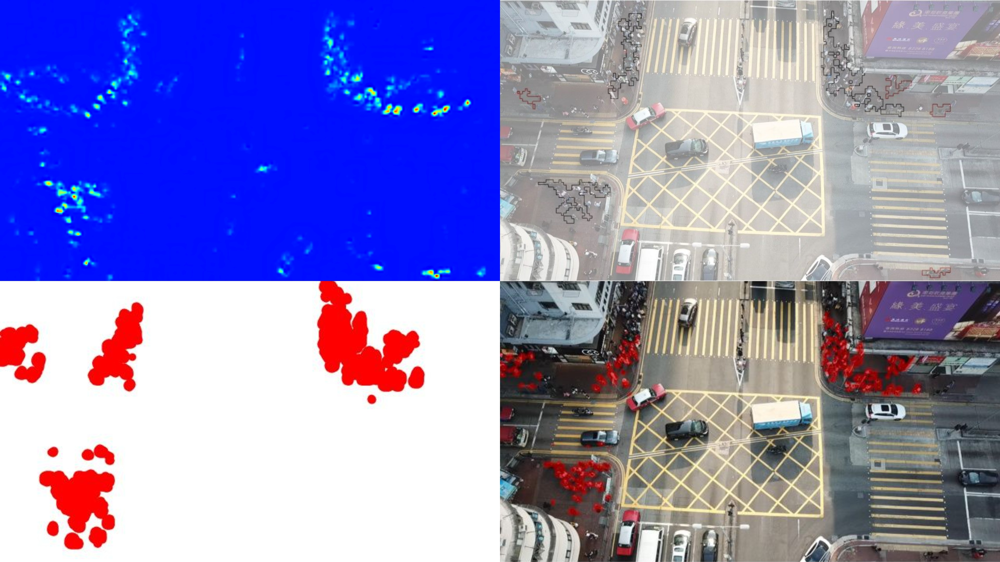

# Using Artificial Intelligence to detect crowds and any changes within them
> This GitHub repository documents the different approaches and methods tried along with containing the final working method.
> 
> Each section is self-contained and has a corresponding README explaining how they work and how to run the code.

### The final model running in TensorRT
The [inference file](inference) contains and documents the final method used involving TensorRT ad postprocessing using dbscan

The majority of changes made moving to this method were done to reduce the inferencing time on each frame.

You can find more information on this section [here](inference/README.md)

### PyTorch and creating the onnx model
The [src file](src) contains the original model, how it is run, and the additions made to convert it into the onnx format. Additionally, it includes testing with onnxRuntime to ensure that the onnx file works as expected.

You can find more information on this section [here](src/README.md)

### Custom clustering program
The [clustering file](clustering) contains a custom program written to take the output of the inferencing and return groupings along with accurate headcounts along with a map to display the results.

I dropped this from the end product favouring the dbscan system, which could produce similar results about ten times faster.

You can find more information on this section [here](clustering/README.md)

### Unsucessfull attempt using deepstream
The [deepstream file](deepstream) contains the base code for running the model in NVIDIA deepstream.

However, it was not usable due to an accuracy problem caused by the preprocessing used in deepstream as it does not support channel-wise normalisation.

You can find more information on this section [here](deepstream/README.md)
