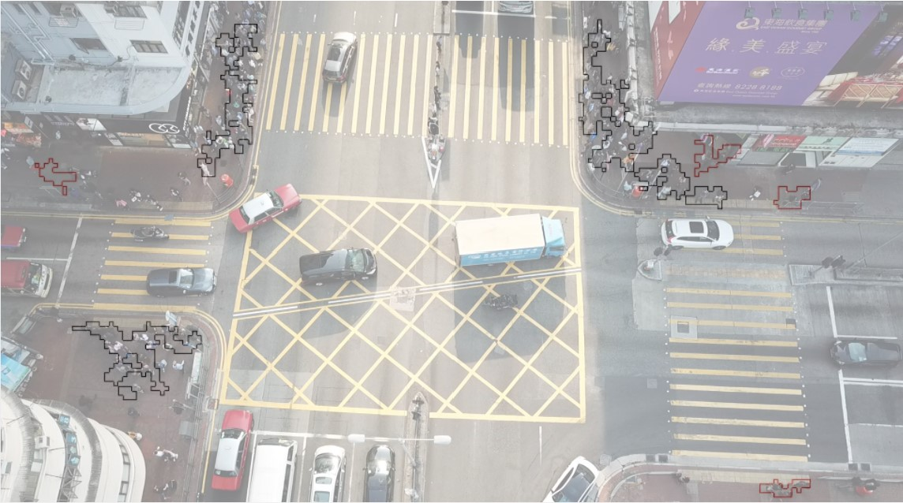

## Details

> A custom post-processing clustering that produces an outline of large groups of pedestrians along with an estimated count.
### How it works
The detection output of a model is loaded, and for each pixel, if it detects confidence more significant than the **detection_value**, it is marked.
The image is split into a grid of each box size determined by **boxsize**. If over the **coverage**% has a detection, it is recorded as a person/people.
Finally, the positive boxes are chained together into groups through a recursive search. If the group size is more significant than **numBoxes**, it is drawn onto the image in black, indicating a large group. 

All the **variables** are specified and can be changed in [config.txt](config.txt)

### Running the code

To execute use:
  
    python crowds.py
    
Currently, it is running off a text document of an array produced by previous inferencing run on the same image.
If it were to be used in a complete inferencing program, it would be called after each detection output of your model of choice.
    
## Examples

Using the following image: 

It produces: 

The accuracy of this can be better seen by overlaying the images:  

