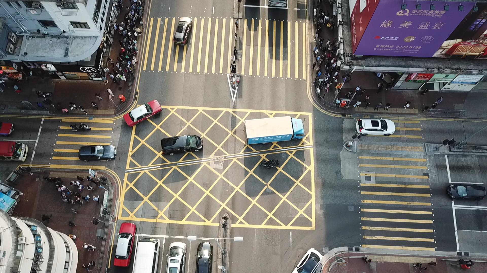
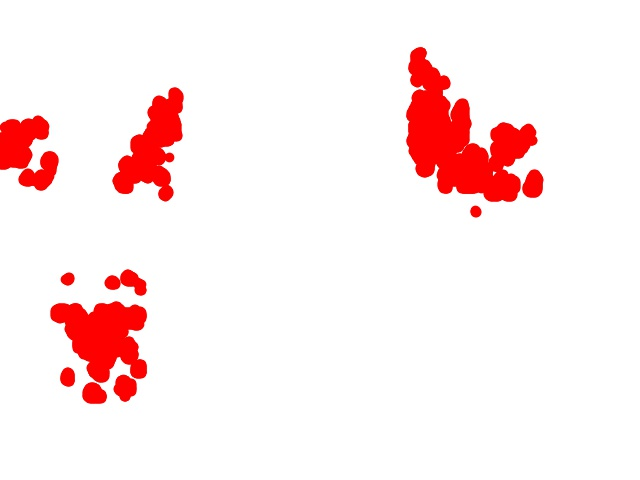
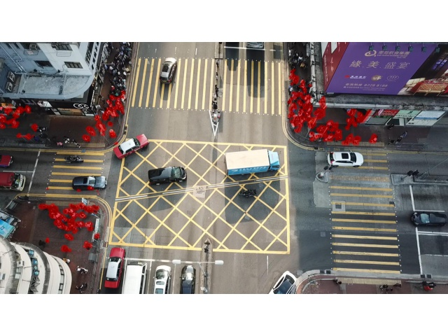

# Inferencing

> Running inference on the model created in [src](../src) through onnxRuntime or Nvidia's TensorRt deep learning 

## Running using TensorRt
TensorRt is used to optimise the inferencing for running on an NVIDIA edge computer to be run on-site as fast as possible.

You can find the main model code in [trt.py](trt.py) but the [preprocessing](preprocessing.py) and [postprocessing](dbscan.py) are seperated

The TensorRt code is run inside a docker container created by the [dockerfile](dockerfile). For example, the docker can be built using:

    sudo docker build . -t jetson_tf

And then run once using:

    sudo docker run --runtime=nvidia -it -v "$(pwd)":/CrowdDetection jetson_tf

Assuming you are running this from the inference file

To open the docker container, use:

    sudo docker run --runtime=nvidia -it -v "$(pwd)":/CrowdDetection jetson_tf /bin/bash

All inputs and changeable config values are found in [config.txt](config.txt)

## Running using onnxRuntime

The same model can also be run using onnxRuntime using [infernece.py](infernece.py)

It uses the same [preprocessing](preprocessing.py) and [postprocessing](dbscan.py)

To run, use

    python inference.py 

Note: running the onnxRuntime on a video input has not been implemented

## Output settings

All the **variables** are specified and can be changed in [config.txt](config.txt)

Both methods use the same pre and post-processing, producing the same results from the same config values; however, the onnxRuntime cannot run from video input.

The intervals of which it will process frames from a video can be changed by editing **interval**

If a video input is used as the **mediaIn** for TensorRt, it will save outputs inside the chosen **outputFile** with names as **outputIMG**%d where %d is the increasing frame number. These frames can be combined back into a video using FFmpeg.
For example, a 30fps video where **outputIMG** was set to **out** the frames are saved into a video called stiched_video.mp4 using:

    ffmpeg -framerate 30 -i out%d.jpg -vf "crop=trunc(iw/2)*2:trunc(ih/2)*2" -y ./stiched_video.mp4
    
To run faster processing producing an output image can be disabled by changing the value of **outputTF** to 0

The output image can either be a heatmap on an empty page (overlay = 0) or be saved as an overlay from the original frame (overlay = 1)

The heatmap produced by dbscan is controlled by the variables **epsilon** and **min_samples** :
* **epsilon** is the distance between two points to be considered neighbours 
* **min_samples** is the minimum number of neighbours a given point should have to be classified as a core point 
* These values need to be adjusted for the image being processed
* You can find more information on dbscan [here](https://scikit-learn.org/stable/modules/generated/sklearn.cluster.DBSCAN.html)

## Examples

Using the following image: 
And config values of:
* epsilon = 40
* min_samples = 1500
* overlay = 0

It produces: 

With overlay set to 1, it produces:

