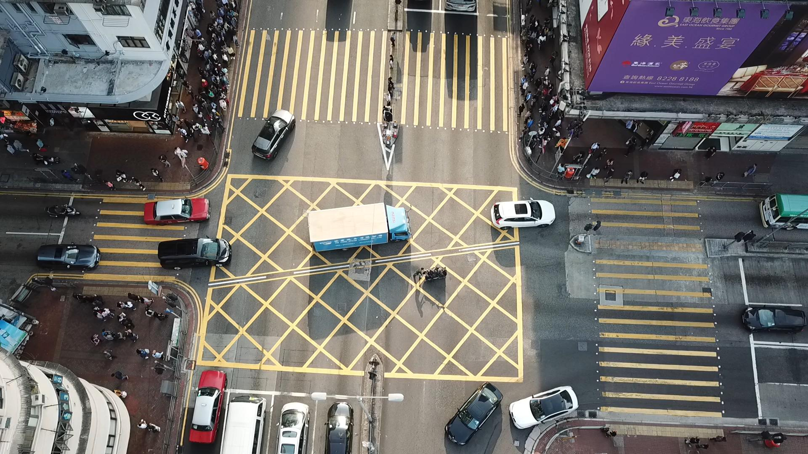

## The original pytorch model and converting into onnx
> The pytoch model being used is an adapted version of [CrowdCounting on VisDrone2020](https://github.com/pasqualedem/CrowdCounting-on-VisDrone2020) created by pasqualedem and uses the [MobileCount](https://github.com/SelinaFelton/MobileCount) models plus 2 two variants of it.

### Running the code

Install [requirements.txt](requirements.txt) and Python 3.8

To execute from the src file, use:
  
    python main.py args
    
The first arg is the modality, can be: run or onnx

For run mode, you must also specify:

<ul>
<li>--path: path to the video or image file, or the folder containing the image</li>
<li>--callbacks: list of callback function to be executed after the forward of each element</li>
</ul>

To run/test other models, use:

<ul>
<li>--model: path to the onnx or txt file of output values
</ul>

For example:
To count the number of pedestrians on the test image using the PyTorch model use:

    python main.py run --path crowd.jpg --callbacks [\'count_callback\']
    
To save a heatmap of the amount of pedestrians on the test image using onnxruntime use:
    
    python main.py run --path crowd.jpg --callbacks [\'save_callback\'] --model DroneCrowd11-540x960.onnx
    
To test a different models output (stored in numpy.savetxt) by being shown all information produced from the test image use:
    
    python main.py run --path crowd.jpg --callbacks [\'display_callback\'] --model values.txt

To create the onnx model, use:

    python main.py onnx
    
## Examples

Using the following image: 

The 1080x1960 model produces: 

And the 540x960 model produces: 

The larger model is noticeably more accurate at detections, especially at the area with a dense group. However, it is four times the size, so it takes longer to process per image. Additionally, it requires a large GPU memory to convert the larger model, and most computers will crash.
